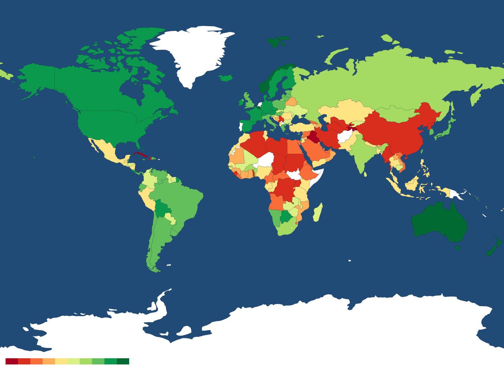
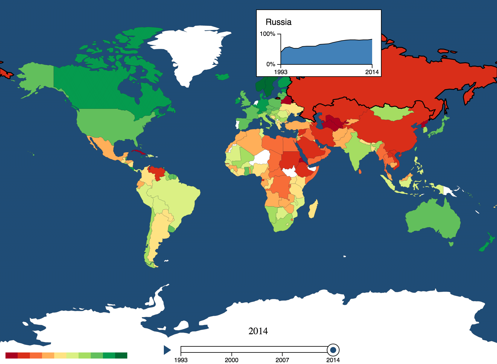

# Визуализация геоданных в D3.js

## Что такое D3.js?

Для тех, кто не слышал про [D3.js][23], напомню, что это библиотека
для визуализации данных, обладающая большой гибкостью и имеющая широкий спектр применения.

В этой статье я хочу пошагово рассказать как сделать простую визуализацию
на географической карте при помощи связки D3.js и [TopoJSON][7]. Будут затронуты
вопросы конвертации данных и их последующая загрузка, также рассмотрим стилизацию
карты и создание интерактивных элементов.

В качестве объекта визуализации был выбран индекс свободы прессы.
Визуализация довольно проста, но поможет понять и освоить основные
приемы работы с картами в D3.js. Итак, начнём!

## Где взять данные о картах?

Как мы знаем, карта представляет из себя контуры, линии, границы государств,
береговые линии и много другой геометрии. Для получения этих данных мы
будем обращаться к [shapefile][24] — популярному формату геоданных. Shapefile
позволяет хранить точки, линии, полигоны и другие объекты.
Также может содержать информацию о параметрах типа температуры, названий, 
глубины и т.д. Hа самом деле, shapefile представляет из себя набор из трёх 
файлов: *.shp, *.shx и *.dbf. Важно, чтобы все три файла находились в одной директории.

В сети существует множество источников shapefile-данных, но для меня самым
подходящим, понятным и удобным источником оказался ресурс [Natural Earth][2].
Он содержит карты территорий государств с границами (что нам и нужно),
физические и даже растровые изображения поверхности планеты.
В качестве альтернативы можно рассмотреть [Global Administrative Areas][3]
и [OpenLayers3][4]. Мы будем использовать контурную [карту][5] масштаба 1:110м.

## Зависимости

Ниже приводятся некоторые подготовительные действия для системы Ubuntu 14.04.
Нам понадобится несколько утилит для обработки и конвертации геоданных:

* [ogr2ogr][6]
* [TopoJSON][7]

Для TopoJSON нам понадобится Node.js, его можно найти  в виде пакета в
репозитории:

    $ sudo apt-get install nodejs
    $ sudo apt-get install npm

Далее устанавливаем TopoJSON:

    $ sudo npm install -g topojson

Если вы выбрали бинарный пакет Node.js, при установке возможна такая проблема:

    /usr/bin/env: node: No such file or directory

Для устранения достаточно прописать ссылку на Node.js:

    $ ln -s /usr/bin/nodejs /usr/bin/node

Для установки ogr2ogr достаточно установить [Geospatial Data Abstraction Library][8] (GDAL), 
которая включает в себя нужную нам утилиту:

    $ sudo apt-get install gdal-bin

Если вы пользователь Mac, то установка происходит через brew:

    $ brew install gdal

## Конвертация данных

Сначала нам нужно получить из shapefiles конечный TopoJSON-файл.
Для этого нам понадобится сгенерировать промежуточный файл GeoJSON.
На этапе генерации GeoJSON-файла мы получаем возможность отфильтровать
из shapefiles данные, которые нам не нужны, и уменьшить в значениях
число знаков после запятой, что важно для увеличения скорости рендеринга,
да и просто сокращает размер файла примерно на 85%.

В конечном итоге процесс конвертации данных схематично выглядит так:

    shapefiles ⟶ GeoJSON ⟶ TopoJSON

Итак, приступим к конвертации. Нам нужно получить TopoJSON со странами мира:

1. Загрузка и распаковка архива.   
  На сайте [Natural Earth][2] в разделе _Downloads_ выбираем
  _1:110m Cultural Vectors_, в представленном списке выбираем раздел
  _Admin 0 — Countries_ и жмём _Download countries_. Очень советую зайти и
  посмотреть что вообще предлагается и какие форматы представлены.

2. Конвертируем shapefiles-данные в GeoJSON: 

            $ ogr2ogr -f GeoJSON world.json ne_10m_admin_0_countries/ne_10m_admin_0_countries.shp`
  
  `world.json` — имя файла, который будет создан по результату генерации.
  
3. Конвертируем GeoJSON в TopoJSON:
            
            $ topojson -o topoworld.json --id-property SU_A3 world.json

  `topoworld.json` — результирующий TopoJSON-файл.

Как по мне, тема работы с утилитами ogr2ogr и topojson достойна отдельной
статьи. Поиграйте с различными фильтрами. Например, отдельно Украину с
границами областей можно получить так:

    $ ogr2ogr -f GeoJSON -where "ADM0_A3 IN ('UKR')" ukraine.json ne_10m_admin_0_map_subunits/ne_10m_admin_0_map_subunits.shp
    $ ogr2ogr -f GeoJSON -where "ISO_A2 = 'UA' AND SCALERANK < 8" ukr_obls.json ne_10m_populated_places/ne_10m_populated_places.shp
    $ topojson -o ukr.json --id-property SU_A3 --properties name=NAME ukraine.json ukr_obls.json

Также нам понадобятся данные о свободе прессы за последние годы. 
Нужную информацию в приемлемом формате можно найти на [Freedom House][9]. 
Данные представляют собой условный индекс свободы прессы
от 0 до 100, где 0 — наиболее свободные страны, а 100 — наименее свободные.
Далее приведем данные к формату CSV (удобному для работы в D3.js) с таким
заголовком: `Country,ISO3166,1993,...,2014`, где:

* `Country` — название страны;
* `ISO3166` — кодовое обозначение государства в международном формате ISO 3166;
* `1993...2014` — индексы свободы прессы от 0 до 100.

Формализация данных, пожалуй, самое долгое и скучное занятие во всем процессе, 
но этот этап нельзя пропустить.

## Загрузка данных

Приступим непосредственно к веб-разработке. Создадим HTML-файл с такой
структурой:

    <html lang="en">
      <head>
        <meta charset="utf-8">
        
        
      </head>
      <body>
      </body>
    </html>

И шаблон скрипта, в котором будет происходить загрузка и последующая работа с
данными:

    window.onload = function () {
      function init() {
        setMap();
      }
       
      function setMap() {
        loadData();
      }
       
      function loadData() {
        queue()
          .defer(d3.json, "https://raw.githubusercontent.com/FrontenderMagazine/d3js-map-visualization/master/src/data/topoworld.json")  // карта в topoJSON-формате
          .defer(d3.csv, "https://raw.githubusercontent.com/FrontenderMagazine/d3js-map-visualization/master/src/data/freedom.csv")  // данные о свободе слова в cvs-формате
          .await(processData);  // обработка загруженных данных
      }
       
      function processData(error, worldMap, countryData) {
        if (error) return console.error(error);
        console.log(worldMap);
        console.log(countryData);
      }
       
      init();
    };

Как вы заметили, мы использовали асинхронную библиотеку [d3-queue][10],
предназначенную для работы с D3.js (и не только). В этом месте происходит
ожидание загрузки файлов и передача загруженных данных функции `processData` в
переменные `worldMap` и `countryData` соответственно.

Загрузка данных в D3.js требует запуска локального сервера. Если вы
предпочитаете Node.js, то запуск производится при помощи [http-server][11]:

    $ http-server -p 8000 &
    
или используя python2:

    $ python2 -m SimpleHTTPServer 8000

или python3:

    $ python3 -m http-server

После запуска переходим в браузере по http://localhost:8000 и открываем
созданный нами ранее [HTML-документ][22]. Мы увидим пустую страницу, но если откроем
консоль браузера, там обнаружится вывод данных из загруженных файлов:

![Скриншот][Вывод в консоль]

## Отображение карты

Для рендеринга двумерной картинки на странице можно использовать два
основных подхода: SVG и Canvas. Мы будем использовать SVG, так как он
позволяет применять CSS к своим элементам.

Давайте объявим в анонимной функции `window.onload` несколько переменных
(они нам дальше понадобятся):

    var width, height, svg, path;

Так же добавим в `<body>` элемент `

`, в него позже будет
помещён `svg`-элемент. А в `<head>` нужно добавить ещё несколько скриптов:

    
    

Первый для работы с TopoJSON, второй с набором проекций для карт.

Добавим в функцию `setMap` следующий код:

    width = 818, height = 600;
     
    svg = d3.select('#map').append('svg')
        .attr('width', width)
        .attr('height', height);

Для рендеринга карты необходимо еще две вещи: задать проекцию и создать
генератор пути (path generator).

* projection
  В метод `setMap` перед вызовом `loadData()` также  добавим определение
  проекции:
            
            var miller = d3.geo.miller()
                .scale(130)
                .translate([width / 2, height / 2])
                .precision(.1);

  Существует множество видов проекций, на любой вкус и цвет. Одно из
  расширений D3.js предоставляет доступ к большому выбору [проекций][12].

* path generator
  Для генератора пути задаётся определённая проекция:

            var path = d3.geo.path().projection(mercator);

  Здесь создаётся объект, который будет превращать геоданные в множество
  последовательных линий.

Для рендеринга в функции `processData` из объекта `worldMap` (`countryData`
пока не трогаем), который представляет из себя TopoJSON, получаем
GeoJSON (TopoJSON ⟶ GeoJSON):

    var world = topojson.feature(worldMap, worldMap.objects.world);

и полученный GeoJSON передаём в `drawMap`.

В `drawMap` рендеринг карты можно осуществить несколькими способами:

* Рендеринг всей карты сразу. В этом случае передаём целый GeoJSON:

            svg.append("path")
               .datum(world)
               .attr("d", path);

* Рендеринг карты по одной стране     
  Этот вариант предусматривает манипуляцию с каждым отдельно взятым полигоном
  страны.

            var map = svg.append("g");
            map.selectAll(".country")
               .data(world.features)
               .enter()
               .append("path")
               .attr("class", "country")
               .attr("d", path);

  Метод `data` всегда принимает список. В данном случае, список стран с
  соответствующей геометрией.
  
Мы воспользуемся вторым вариантом, так как это позволит нам осуществлять
последующие манипуляции с каждой страной (цвет, границы и т.д.).

После всех манипуляций мы должны получить карту с границами государств.

<iframe class="example" src="src/step-2/index.html" width="100%" height="605"></iframe>

## Отображение данных на карте, легенда

Для отрисовки данных о свободе слова нам необходимо ассоциировать их с каждой
страной, и теперь наша задача состоит в том, чтобы добавить в GeoJSON (объект `world`) данные о
свободе слова (объект `countryData`). Добавим данные в функцию `processData` перед вызовом `drawMap(world)`:

    var countries = world.features;
    for (var i in countries) {
        for (var j in countryData) {
            if (countries[i].id == countryData[j].ISO3166) {
                for(var k in countryData[j]) {
                    if (k != 'Country' && k != 'ISO3166') {
                        if (years.indexOf(k) == -1) {
                            years.push(k);
                        }
                        countries[i].properties[k] = Number(countryData[j][k])
                    }
                }
                break;
            }
        }
    }

Также рядом с переменными `width, height, svg, path`, объявим переменную
`years = []`, в которую будут записаны годы с 1993 по 2014.
Теперь у каждой страны в атрибуте `properties` есть данные, разложенные по годам.
Данные лежат таким образом, что каждому значению года соответствует одно
условное значение от 0 до 100 (где 0 — абсолютная свобода прессы,
100 — абсолютная цензура).

## Добавление цвета и стиля

Добавим немного стилей для чёткости границ стран — сейчас это 
больше похоже на артефакты, чем границы государств. Также добавим «морской» фон для
карты, применив цвет к `<svg>` элементу.

    svg {
        background: #234c75;
        border:solid black 1px;
    }
    .country {
        stroke: black;
        stroke-width: 0.1;
    }

Если вы сейчас решили проверить промежуточный результат, то границ вы не
увидите, потому что они сливаются с цветом страны. Чёткость границ будет
видна при заполнении стран цветом.

Для читаемости карты были выбраны цвета от тёмно-зелёного
(значения 0—10), до тёмно-красного (значения 90—100). Для подбора
соответствующих цветов был задействован ресурс [colorbrewer][13], специально
созданный для подбора цветовой гаммы для геокарт. Здесь можно выбрать количество
цветов, природу данных и некоторые другие полезные параметры и получить превью.

![Рисунок][Набор цветов]

В `setMap()` добавим цвета и генератор цвета `getColor`, который выдаёт цвета
в зависимости от значения от 0 до 100:

    colors = [
        '#a50026',
        '#d73027',
        '#f46d43',
        '#fdae61',
        '#fee08b',
        '#d9ef8b',
        '#a6d96a',
        '#66bd63',
        '#1a9850',
        '#006837'];
    defColor = "white";
    getColor = d3.scale.quantize().domain([100,0]).range(colors);

а так же добавим эти переменные в блок с переменными:

    var width, height, svg, path,
        years = [],
        colors, defColor, getColor;

Белый цвет был выбран дефолтным для стран, у которых не нашлось
данных за текущий год или данных по ним нет в принципе или там совсем нет прессы :)

Добавим в блок с переменными `currentYear = "1993"` и произведём первую
итерацию визуализации данных для текущего года. Для этого сделаем вызов
`sequenceMap` в функции `drawMap`. Функция `sequenceMap` может, зная
текущий год, перерисовать цвета всех стран и имеет такой вид:

    function sequenceMap() {
        d3.selectAll('.country')
            .style('fill', function(d) {
                color = getColor(d.properties[currentYear]);
                return color ? color : defColor;
            });
    }

Здесь был осуществлён проход по странам и заполнение соответствующим цветом
каждой страны. Если данные не найдены, страна будет окрашена в белый
цвет.

## Легенда карты

Теперь на очереди добавление легенды карты. Добавим функцию `addLegend()`,
которую нужно будет вызвать в конце функции `drawMap`:

    function addLegend() {
        var lw = 200, lh = 10,  // Ширина и высота легенды
            lpad = 10,  // Отступ внутри легенды
            lcw = lw / 10;  // Ширина категорий легенды
        
        var legend = svg.append("g")
            .attr(
                "transform",
                "translate(" + (width+(lpad-width)) + "," + (height-(lh+lpad)) + ")");
      
        legend.append("rect")
            .attr("width", lw)
            .attr("height", lh)
            .style("fill", "white");
      
        var lcolors = legend.append("g")
            .style("fill", defColor);
      
        for (i = 0; i < 10; i++) {
            lcolors.append("rect")
                .attr("height", 10)
                .attr("width", lcw)
                .attr("x", i * lcw)
                .style("fill", colors[i]);
        }
    }

Легенда представляет собой элемент `<g>` (group), в котором друг за другом
расположены 10 цветных прямоугольников (`<rect>`), соответствующие градациям
свободы прессы от 0 до 100.

На данном этапе карта должна представлять из себя вот такую картинку:

<iframe class="example" src="src/step-3/index.html" width="100%" height="605"></iframe>

## Слайдер

Теперь добавим слайдер, который внесёт элемент анимации и обновление карты по
годам. Слайдер состоит из нескольких независимых компонентов:

* текстовый индикатор текущего года
* непосредственно сам слайдер
* кнопка, позволяющая прокручивать слайдер циклично в автоматическом режиме

Функция `addSlider` состоит из 3 частей, как описано выше, её вызов
должен произойти сразу после вызова `addLegend` в функции `drawMap`. Код функции выглядит
так:

    function addSlider() {
        // Добавляем индикатор года
        svg.append("text")
            .attr("id", "year")
            .attr("transform", "translate(409,550)")
            .text(currentYear);
        // Добавляем слайдер
        var btn = svg.append("g").attr("class", "button").attr("id", "play")
            .attr("transform", "translate(270,568)")
            .attr("onmouseup", animateMap);
        var playBtn = btn.append("g")
            .attr("class", "play")
            .attr("display", "inline");
        playBtn.append("path")
            .attr("d", "M0 0 L0 16 L12 8 Z")
            .style("fill", "#234c75");
        var stopBtn = btn.append("g")
            .attr("class", "stop")
            .attr("display", "none");
        stopBtn.append("path")
            .attr("d", "m 0,0 0,16")
            .attr("stroke", "#234c75")
            .attr("stroke-width", 6);
        stopBtn.append("path")
            .attr("d", "m 8,0 0,16")
            .attr("stroke", "#234c75")
            .attr("stroke-width", 6);
      
        // Инициализируем слайдер
        var formatter = d3.format("04d");
        var tickFormatter = function(d) {
            return formatter(d);
        }
     
        slider = d3.slider().min('1993').max('2014')
            .tickValues(['1993','2000','2007','2014'])
            .stepValues(d3.range(1993,2015))
            .tickFormat(tickFormatter);
     
        svg.append("g")
            .attr("width", 300)
            .attr("id", "slider")
            .attr("transform", "translate(273,545)");
        // Рендерим слайдер в div
        d3.select('#slider').call(slider);
        var dragBehaviour = d3.behavior.drag();
     
        dragBehaviour.on("drag", function(d){
            var pos = d3.event.x;
            slider.move(pos+25);
            currentYear = slider.value();
            sequenceMap();
            d3.select("#year").text(currentYear);
        });
     
        svg.selectAll(".dragger").call(dragBehaviour);
    }

Кнопка на событие `click` вызывает функцию `animateMap`, которая, в свою
очередь, производит инкремент года и вызов `sequenceMap` для обновления карты.
Это происходит до тех пор, пока не будет достигнут последний год в списке, после чего итерация
начинается с первого года. А вот так выглядит функция `animateMap`:

    function animateMap() {
        var timer;
        d3.select('#play').on('click', function() {
            if (playing == false) {
                timer = setInterval(function() {
                    if (currentYear < years[years.length-1]) {
                        currentYear = (parseInt(currentYear) + 1).toString()
                    } else {
                        currentYear = years[0];
                    }
                    sequenceMap();
                    slider.setValue(currentYear);
                    d3.select("#year").text(currentYear);
                }, 1000);
       
                d3.select(this).select('.play').attr('display', 'none');
                d3.select(this).select('.stop').attr('display', 'inline');
                playing = true;
            } else {
                clearInterval(timer);
                d3.select(this).select('.play').attr('display', 'inline');
                d3.select(this).select('.stop').attr('display', 'none');
                playing = false;
            }
        });
    }

Слайдер (написан неким [sujeetsr][14]) был взят из [репозитория][15] и немного
адаптирован под наш проект. Также нужно не забыть подключить соответствующие стили и скрипты.

<iframe class="example" src="src/step-4/index.html" width="100%" height="605"></iframe>

## Почти закончили

Напоследок хотелось добавить всплывающие подсказки для каждой страны. Подсказка
представляет собой квадрат (`<rect>`), содержащий название страны и тренд в виде
графика индекса свободы слова за весь период по отдельно взятой стране.
Для работы с подсказкой были задействованы такие элементы и техники:

* [axis][16]
* [area][17]
* line
* области с пропущенными данными ([area with missing data][18])
* [паттерн][19] обновления данных с переходами
* события мыши (mousemove, mouseover, mouseout)

Так же дополнительные материалы по картам можно найти [здесь][20].

И финальная версия визуализации будет выглядеть так:

<iframe class="example" src="src/step-0/index.html" width="100%" height="605"></iframe>

Полные исходники прототипа можно посмотреть [здесь][21].

## Заключение

Конечно, это только малая часть того, что можно делать с картами в D3.js, но
очень надеюсь, что основная цель статьи — показать и задать направление изучения
визуализаций на картах в D3.js, была достигнута. В комментариях можно задать
дополнительные вопросы, оставить предложения и критику, буду рад!

[1]: step-final.html
[2]: http://www.naturalearthdata.com
[3]: http://gadm.org/country
[4]: http://openlayers.org/
[5]: http//www.naturalearthdata.com/download/110m/cultural/ne_110m_admin_0_countries.zip
[6]: http://www.gdal.org/ogr2ogr.html
[7]: https://github.com/mbostock/topojson
[8]: http://www.gdal.org/
[9]: https://freedomhouse.org/report-types/freedom-press
[10]: https://github.com/d3/d3-queue
[11]: https://github.com/indexzero/http-server
[12]: https://github.com/d3/d3-geo-projection/
[13]: http://colorbrewer2.org/
[14]: https://github.com/sujeetsr
[15]: https://github.com/sujeetsr/d3.slider
[16]: https://github.com/mbostock/d3/wiki/SVG-Axes
[17]: https://bl.ocks.org/mbostock/3883195
[18]: http://bl.ocks.org/mbostock/3035090
[19]: https://bl.ocks.org/mbostock/3808234
[20]: http://bost.ocks.org/mike/map/
[21]: https://github.com/FrontenderMagazine/d3js-map-visualization/tree/master/src/step-0
[22]: src/step-1/index.html
[23]: https://d3js.org/
[24]: https://en.wikipedia.org/wiki/Shapefile

[Набор цветов]: img/colors.png "Набор цветов"
[Вывод в консоль]: img/console.png "Вывод в консоль"
